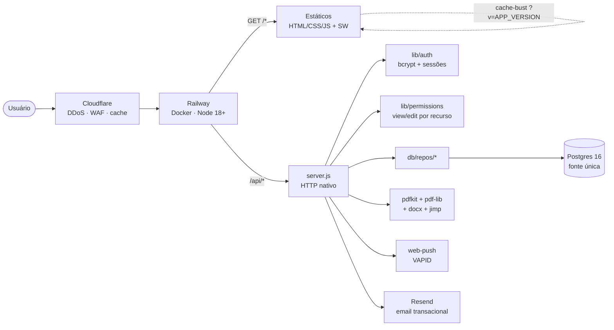
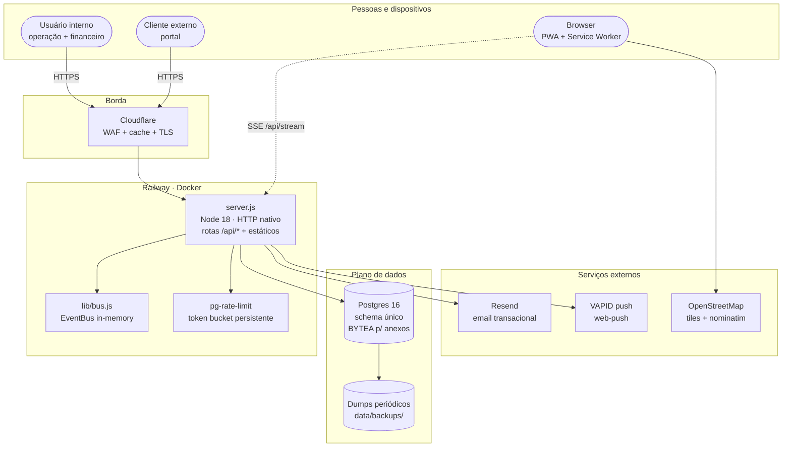
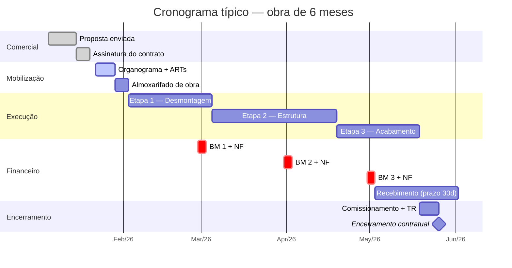
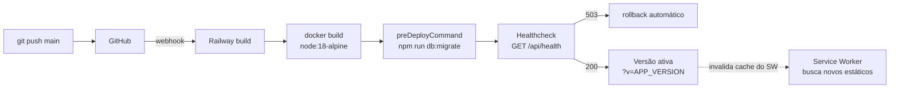

# Rhino

Sistema de gestão empresarial para empresas de construção e serviços industriais: contratos de obras, propostas comerciais, financeiro, RDOs, frota, estoque e cadastros. SPA em JavaScript puro com backend Node.js + Postgres.

Em produção: <https://rhino.up.railway.app>

> **Documentação técnica profunda** (ER completo, sequences, permission flow, SSE) em [`docs/ARCHITECTURE.md`](./docs/ARCHITECTURE.md).
> **Manual do usuário** (fluxogramas operacionais) está embutido no app na rota `#/manual`.

---

## Visão geral em uma figura



## Diagrama de containers (C4 nível 2)



---

## Módulos

**Operação**
- **Dashboard** — KPIs, sparklines de 45 dias, score de saúde financeira (0–100)
- **Contratos** — cadastro, detalhamento, saídas, cobrança mensal, aditivos, marcos, ocorrências, cronograma físico-financeiro
- **Propostas** — editor completo com PDF/DOCX em timbrado oficial, anexos PDF concatenados, galeria de logos de cases
- **Apresentação** — textos institucionais aplicados a todas as propostas
- **Cláusulas** — biblioteca reutilizável
- **RDOs** — relatórios diários com fotos e assinaturas (canvas → BYTEA)
- **Obras / Mapa de Obras** — visualização geográfica (Leaflet + OpenStreetMap)
- **Frota** — veículos, planos de manutenção e histórico
- **Estoque** — almoxarifado central + por obra, movimentação, custo médio, solicitações de compra
- **Recursos** — colaboradores, documentos (ASO, NR-35…), folgas, alocação por contrato

**Comercial e cadastros**
- **Clientes** (com portal externo) e **Fornecedores**
- **BASE** — itens administrativos (overhead) alocáveis em contratos

**Financeiro**
- Caixa, Contas a Pagar (com recorrência), Notas Fiscais, Sócios, Aportes, Investimentos, Conciliação, Previsão, Comparativo

**Plataforma**
- **Usuários e Níveis** — gestão de contas com bcrypt + sessões em Postgres
- **Auditoria** — log de toda mutação (`audit_log` com `before_state`)
- **Documentos** — repositório de templates
- **AI Chat** — assistente integrado (Claude · gated por feature flag)
- **Portal** — área externa do cliente
- **Manual** — documentação in-app com fluxogramas Mermaid

---

## Ciclo de uma obra (Gantt)

Como um contrato típico flui do comercial ao recebimento financeiro:



---

## Stack

- **Frontend**: HTML + CSS + JS sem bundler, Chart.js, Leaflet, Service Worker com cache-busting por versão, Mermaid carregado sob demanda
- **Backend**: Node.js >= 18 (`server.js`, HTTP nativo, sem Express), pool `pg`
- **Banco**: Postgres 16 (fonte única — JSONs em `data/` são vestígio histórico)
- **PDF/DOCX**: `pdfkit`, `pdf-lib`, `pdf-to-img`, `docx`, `jimp`
- **Notificações**: `web-push` (VAPID)
- **Realtime**: SSE in-memory (`lib/bus.js` + `/api/stream`)
- **Deploy**: Railway (Docker) — alternativas Fly.io e VPS (Caddy) prontas
- **Testes**: `node --test` + Playwright (E2E de API)

---

## Estrutura do repositório

```
.
├── index.html              # shell da SPA
├── css/                    # estilos (main, components)
├── js/
│   ├── app.js              # roteamento, sidebar, perfil de acesso
│   ├── store.js            # estado global e chamadas à API
│   ├── realtime.js         # cliente SSE
│   ├── lazy.js             # carregamento sob demanda (mermaid, chart, …)
│   ├── lib/                # bibliotecas vendorizadas
│   └── views/              # uma view por módulo (Propostas, Contratos, ...)
├── server.js               # API HTTP + estáticos
├── lib/                    # módulos de servidor (auth, permissions, pdf, …)
├── db/
│   ├── schema.sql          # schema canônico
│   ├── migrations/         # migrations idempotentes (rodam no preDeploy)
│   └── repos/              # camada de acesso por entidade
├── scripts/                # CLIs (migrações, seed, backup, smoke, bump-version)
├── test/                   # unit + Playwright E2E
├── data/                   # JSONs do modo legacy local (fallback)
├── docs/
│   └── ARCHITECTURE.md     # arquitetura profunda + sequences + ER
├── Dockerfile
├── docker-compose.yml      # dev local (app + Postgres)
├── docker-compose.prod.yml # VPS com Caddy
├── railway.json            # deploy canônico (Railway + Dockerfile)
├── deploy-archive/         # alvos alternativos arquivados (fly/render/firebase)
└── DEPLOY.md               # guia completo de deploy
```

---

## Desenvolvimento local

Requer Node.js >= 18.

```bash
npm install
npm start            # http://localhost:3001
```

### Docker (app + Postgres)

```bash
cp .env.example .env
docker compose up -d --build
# App:    http://localhost:3001
# Banco:  postgres://rhino:<senha>@localhost:5432/rhino
docker compose down       # para sem apagar dados
docker compose down -v    # apaga volume do banco
```

O schema inicial (`db/schema.sql`) é aplicado no primeiro `up` via `docker-entrypoint-initdb.d`.

---

## Testes

```bash
npm test                 # unit (node --test)
npm run test:e2e         # Playwright (API)
npm run test:headers     # headers de segurança
npm run test:validate    # validação de payload
npm run test:healthz     # /api/health
```

---

## Migrações e seed

```bash
npm run db:migrate              # roda migrations idempotentes
npm run db:migrate-json         # importa data/*.json para o Postgres (uma vez)
node scripts/seed-realistic.js  # dataset de demonstração (--reset apaga antes)
```

---

## Deploy

Guia completo em [DEPLOY.md](./DEPLOY.md). Pipeline resumido:



- **Railway** (canônico): build via Dockerfile, `preDeployCommand` roda `npm run db:migrate`, healthcheck em `/api/health`. Custo estimado ~US$ 8–10/mês.
- **VPS** (Hetzner/DO): `docker-compose.prod.yml` com Caddy + SSL Let's Encrypt automático.
- Alvos alternativos (Fly.io/Render/Firebase) foram arquivados em `deploy-archive/` — não são mais mantidos.
- **Cloudflare** na frente (DDoS, WAF, cache) — instruções no DEPLOY.md.

### Variáveis de ambiente principais

| Var | Obrigatória | Descrição |
|---|---|---|
| `DATABASE_URL` | sim | Postgres connection string |
| `PORT` | sim | porta HTTP (Railway injeta) |
| `NODE_ENV` | recomendada | `production` em prod |
| `APP_VERSION` | recomendada | aparece em `/api/health` e nos `?v=` dos estáticos |
| `ADMIN_EMAIL`, `ADMIN_PASSWORD` | recomendada | bootstrap do primeiro admin |
| `RESEND_API_KEY`, `EMAIL_FROM` | opcional | email transacional (reset de senha) |
| `PG_POOL_MAX` | opcional | tamanho do pool (default 10) |
| `VAPID_PUBLIC_KEY`, `VAPID_PRIVATE_KEY` | opcional | web-push |

---

## Endpoints operacionais

- `GET /api/health` — status app + Postgres (200/503)
- `GET /api/metrics` — contadores HTTP, memória, contagens por tabela
- `GET /api/stream` — SSE de mutações em tempo real (auth)
- `GET /api/online` — usuários conectados ao stream
- `GET /healthz`, `/readyz` — liveness/readiness do balanceador

---

## Segurança

Auditado nas v1.2.x:

- **bcrypt** (10 rounds) para senhas
- **Sessões server-side** em Postgres (cookie `httpOnly` + `SameSite=Lax` + `Secure` em prod), 30 dias
- **Rate limit persistente em PG** (sobrevive a redeploys do Railway):
  - login: 5 tentativas falhas / 15 min / (IP+email) — sucesso faz refund
  - reset de senha: 3 / hora / (IP+email)
  - global: 1000 req/min/IP
- **CSP fechada**: `script-src 'self' https://cdn.jsdelivr.net` (Mermaid ESM apenas), sem `unsafe-inline` em scripts
- **Headers**: HSTS, X-Frame-Options DENY, X-Content-Type-Options nosniff, Referrer-Policy same-origin
- **Reset de senha** via email com token de 1 hora
- **LGPD**: aceite de termos versionado com timestamp
- **Logs estruturados** (JSON) em stdout
- **Anti-escalada** em `/api/users` (super-admin é o único que cria/promove admins)
- **CORS** restrito a same-origin / localhost

---

## Permissões

Modelo por recurso (`view:#/rota`, `edit:#/rota` e ações como `solicitacoes-compra:avaliar`), centralizado em `lib/permissions.js`. Cada perfil em `niveis_acesso` carrega o conjunto de abas/ações; `/api/auth/login` e `/api/auth/me` devolvem o objeto `permissions` resolvido pelo servidor como fonte autoritativa. A sidebar e as rotas no frontend respeitam essas permissões.

Detalhe do fluxo de autorização em [`docs/ARCHITECTURE.md`](./docs/ARCHITECTURE.md#autorização).

---

## Versionamento

Versão atual em `package.json` + `changelog.json` (não fixamos o número aqui pra não desatualizar — `node -e "console.log(require('./package.json').version)"`). Use:

```bash
node scripts/bump-version.js patch "mensagem da entrada"
node scripts/bump-version.js minor "novo módulo X"
node scripts/bump-version.js major "breaking: …"
```

O bump atualiza `package.json`, prepende ao `changelog.json` e cria commit.
