# Arquitetura do Rhino

Doc técnica profunda. Para visão executiva e instruções de uso, ver [`../README.md`](../README.md).

## Sumário

- [Visão geral](#visão-geral)
- [Camadas](#camadas)
- [Modelo de dados (ER)](#modelo-de-dados-er)
- [Fluxos principais (sequence)](#fluxos-principais-sequence)
  - [Login e bootstrap](#login-e-bootstrap)
  - [Saída → BM → NF → Caixa](#saída--bm--nf--caixa)
  - [RDO com assinatura digital](#rdo-com-assinatura-digital)
  - [Solicitação de compra (5 etapas)](#solicitação-de-compra-5-etapas)
  - [Realtime via SSE](#realtime-via-sse)
- [Autorização](#autorização)
- [Status da migração JSON → Postgres](#status-da-migração-json--postgres)
- [Observabilidade](#observabilidade)
- [Performance](#performance)
- [Próximos passos sugeridos](#próximos-passos-sugeridos)

---

## Visão geral

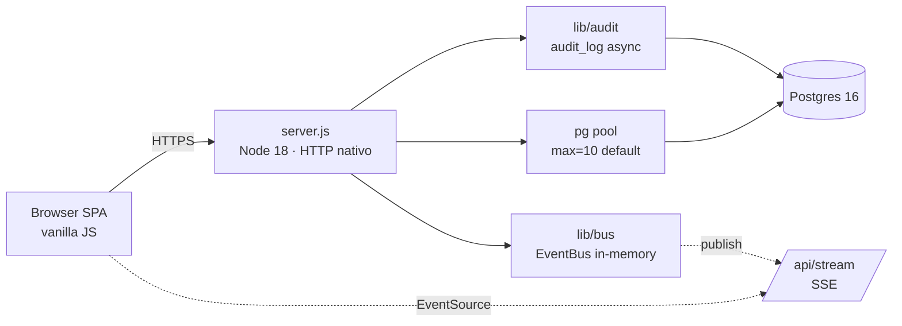

- **Sem framework** no backend. `server.js` faz roteamento `if (pathname === ... && method === ...)` em ~7.200 linhas.
- **Sem bundler** no frontend. `<script defer>` no `index.html` e `js/lazy.js` para libs pesadas (mermaid, chart, signaturepad, jspdf).
- **Postgres é a fonte única**. Diretório `data/*.json` é vestígio do modo legacy e nunca é lido em produção.

---

## Camadas

### Frontend (`/js`, `/css`)

- **SPA puro** (sem bundler), módulos via `<script defer>` no `index.html`
- **Roteamento** por `location.hash` em `js/app.js`
- **Estado global** em `window.Store` (`js/store.js`) — fetcha das APIs e dispara eventos
- **Views** em `js/views/*.js`, cada uma como `window.X = { render(), ... }`
- **PWA** com manifest + service worker (`sw.js`) e cache-busting `?v=APP_VERSION`
- **Realtime** via SSE em `js/realtime.js` — escuta mutações e re-renderiza
- **Lazy loading** em `js/lazy.js`: mermaid, chart.js, leaflet, signature_pad, jspdf carregam só quando a view precisa

### Backend (`server.js` + `lib/` + `db/repos/`)

- **HTTP nativo** (sem Express) — roteamento via `if/match` em `routeRequest()` (linha ~3960)
- **Auth** com cookies de sessão server-side, bcrypt, rate limit persistente em PG (`lib/auth.js`, `lib/pg-rate-limit.js`)
- **Audit** automático em toda mutação POST/PUT/DELETE com status < 500 (`lib/audit.js`, registra `before_state` + `entity_label`)
- **Bus de eventos** in-memory (`lib/bus.js`) — feed do `/api/stream`
- **Repos** abstraem queries do Postgres (`db/repos/*.js`) — sem ORM, SQL direto

### Banco (`db/`)

- **Schema** declarativo em `db/schema.sql` (~980 linhas)
- **Migrations** idempotentes em `db/migrations/` aplicadas via `scripts/run-migrations.js` no `preDeployCommand` do Railway
- **Triggers PG**:
  - `set_updated_at()` BEFORE UPDATE em todas as tabelas mutáveis
  - `log_contract_status_change()` AFTER UPDATE em `contracts` → grava em `contract_status_history` (usado pela cobrança mensal pra calcular dias ativos)
  - `log_contract_status_insert()` AFTER INSERT em `contracts` → primeira linha do histórico

---

## Modelo de dados (ER)

### Núcleo operacional + financeiro

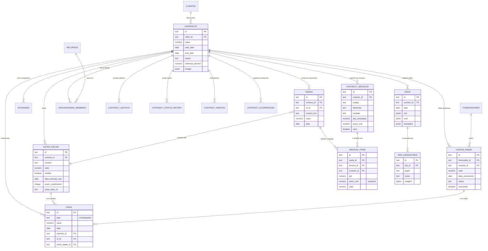

### Plataforma · auth, permissões, auditoria

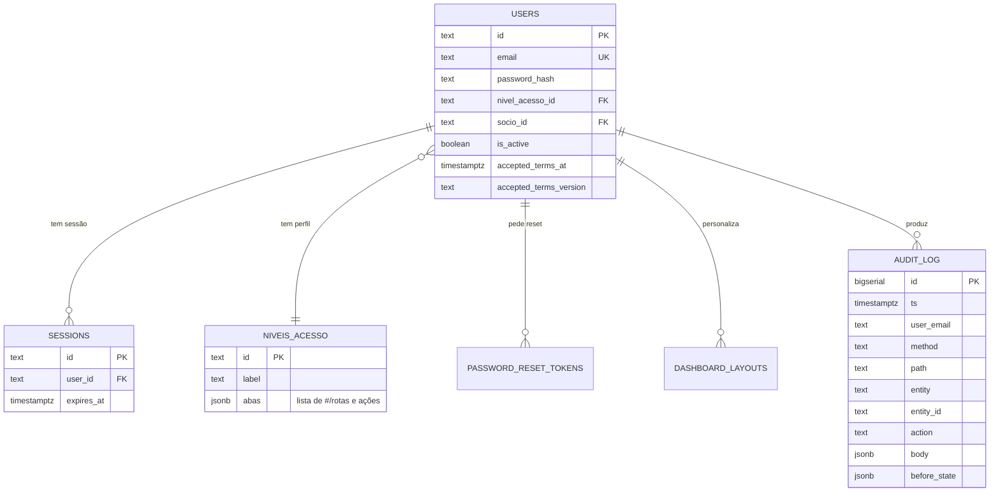

### Suprimentos · estoque e solicitações de compra

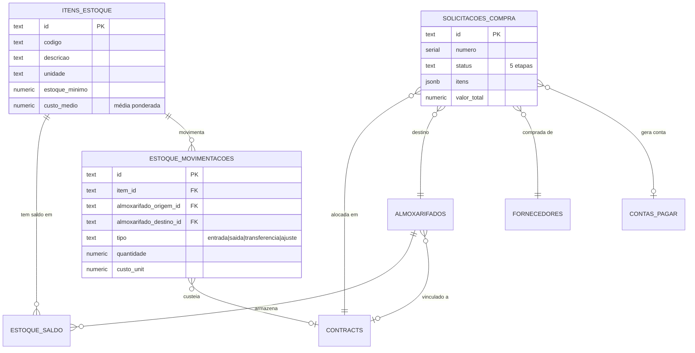

### Comercial · propostas

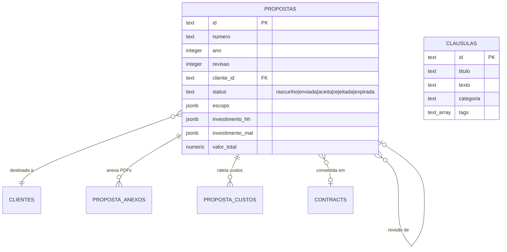

### Frota

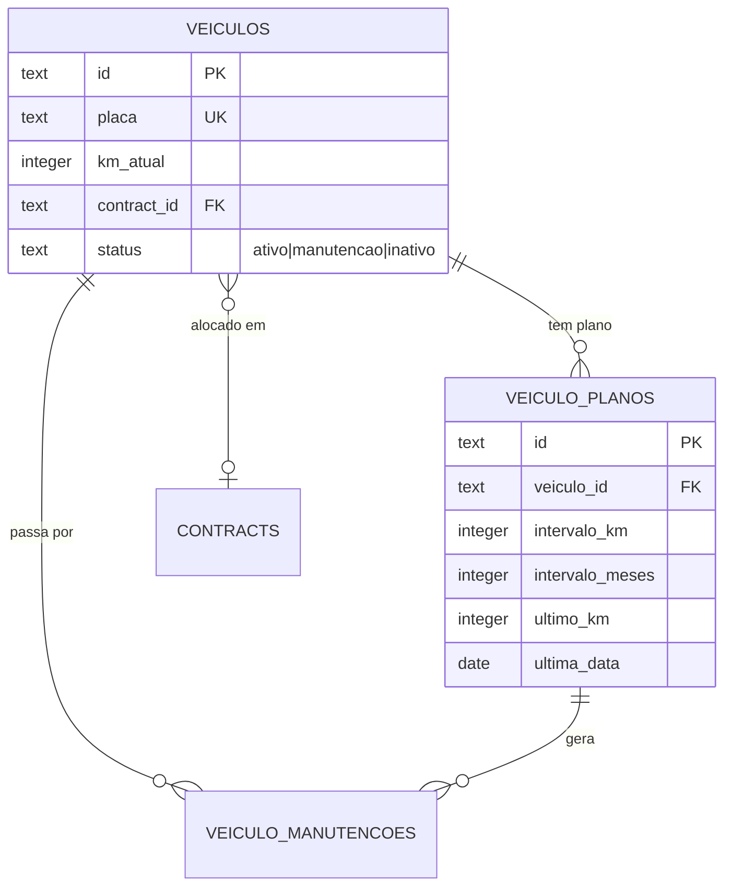

---

## Fluxos principais (sequence)

### Login e bootstrap

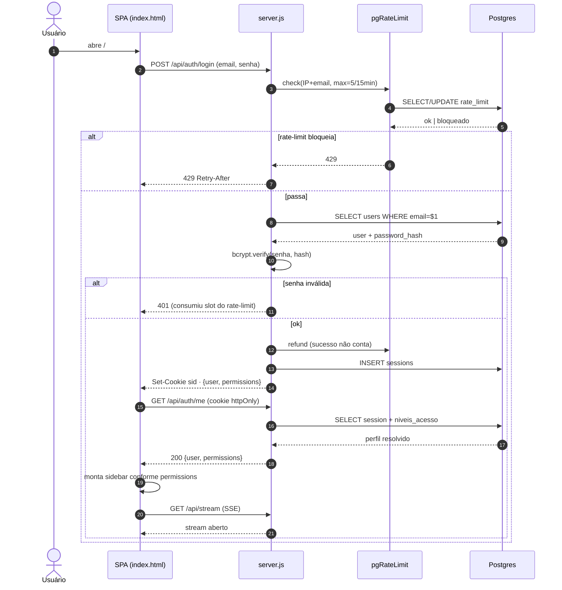

### Saída → BM → NF → Caixa

O fluxo financeiro central. Uma saída cadastrada num contrato vira BM, depois NF, depois entrada de caixa quando o cliente paga.

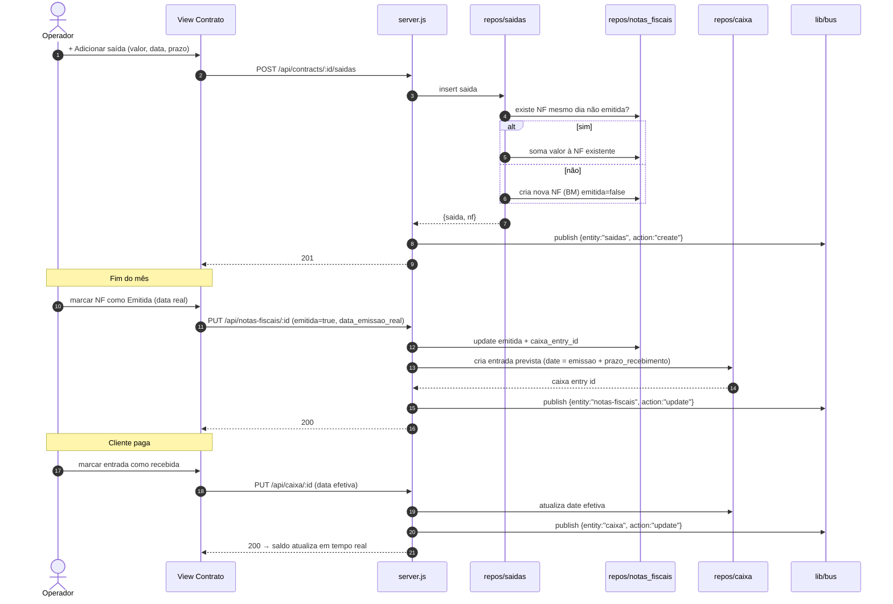

### Medição estruturada (BM por itens)

Convive com o fluxo acima, sem substituí-lo. Contratos **sem** planilha de serviços
seguem medindo por valor fechado (`POST /saidas`); contratos **com** planilha medem
por quantidade × preço unitário (`POST /medicoes`). Nos dois casos o resultado é uma
`saida` agregada numa NF/BM — daí pra frente (emissão, caixa) o caminho é o mesmo.

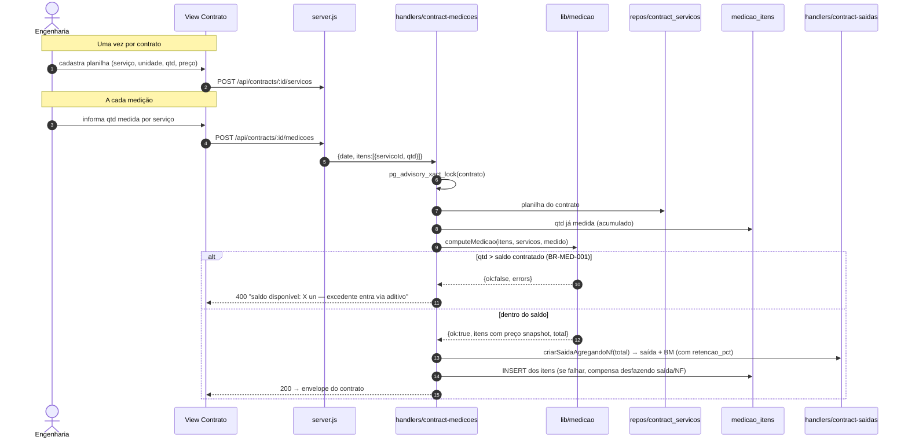

O preço unitário é **snapshot** (reajuste da planilha não retroage a medições
passadas). A retenção é o `%` do contrato (`contracts.retencao_percent`) gravado
como snapshot na NF, com o **valor retido sempre derivado**, nunca armazenado. O BM
aceita aprovação/rejeição do cliente (`POST /bms/:nfId/aprovacao`; rejeição exige
motivo). Regras e testes em `lib/medicao.js` / `test/medicao.test.js`
(`BR-MED-001..005`).

### RDO com assinatura digital

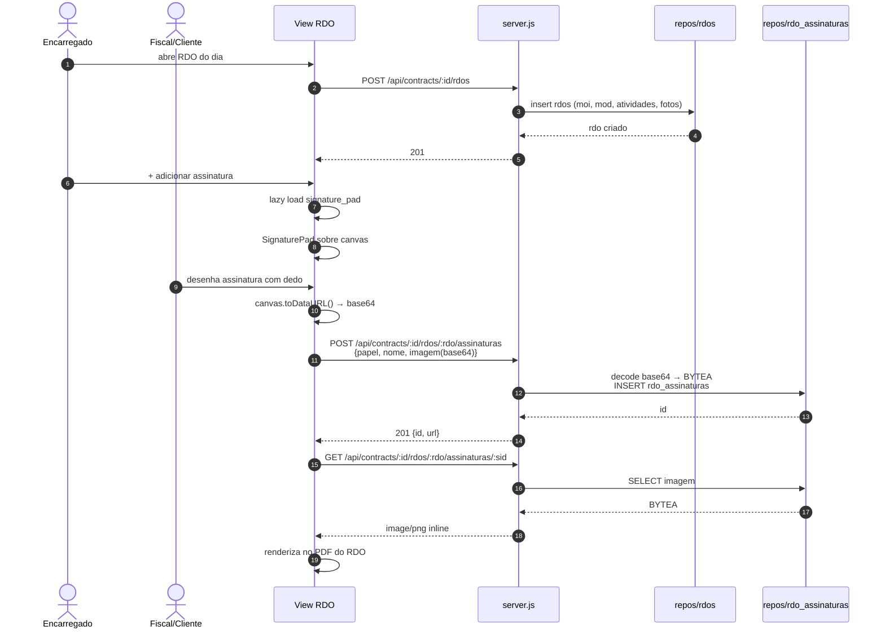

### Solicitação de compra (5 etapas)

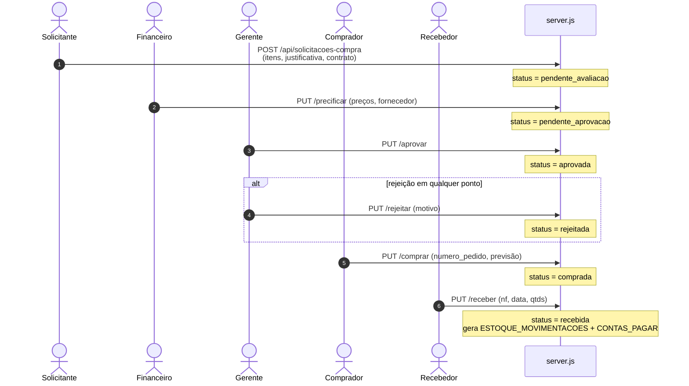

### Realtime via SSE

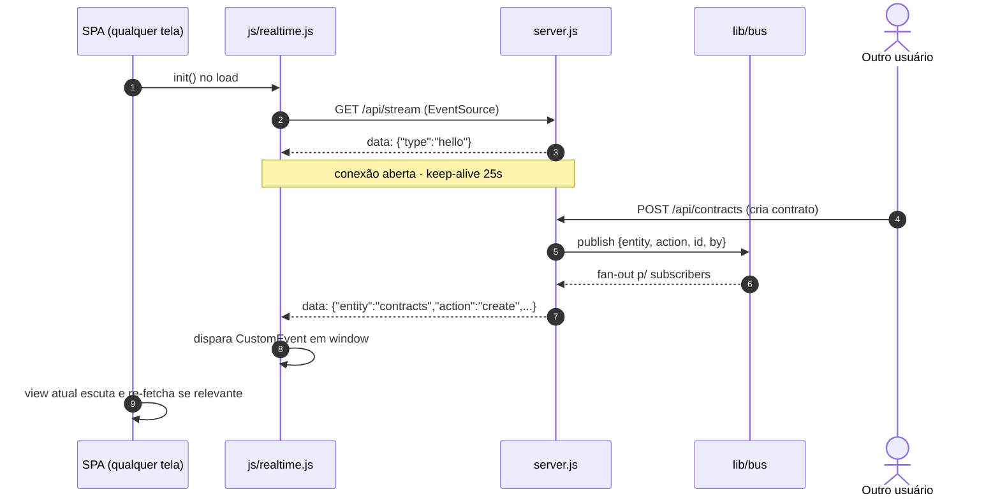

---

## Autorização

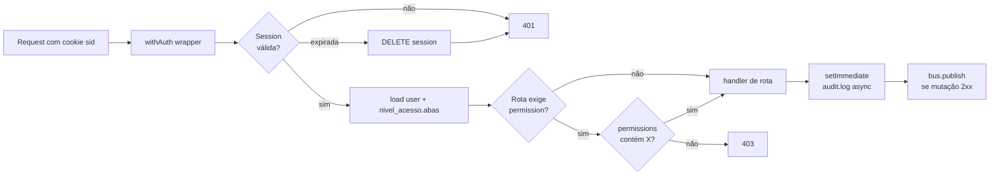

A resolução de `permissions` é feita pelo servidor em `lib/permissions.js#summary(user)`. O frontend recebe o objeto pronto e usa para filtrar sidebar/rotas — **mas o servidor é a verdade**, nunca confia no que o cliente envia.

Exemplo de `niveis_acesso.abas` para perfil `financeiro`:

```json
[
  "#/caixa", "view:#/caixa", "edit:#/caixa",
  "#/contas-pagar", "view:#/contas-pagar", "edit:#/contas-pagar",
  "#/notas-fiscais", "view:#/notas-fiscais", "edit:#/notas-fiscais",
  "#/cobranca",
  "#/solicitacoes-compra", "solicitacoes-compra:avaliar", "solicitacoes-compra:receber"
]
```

---

## Status da migração JSON → Postgres

**Concluído** (todos os reads/writes em runtime passam pelo PG):

| Domínio | Repo | Status |
|---|---|---|
| Contracts + aditivos/marcos/ocorrências | `db/repos/contracts.js` | ✅ |
| Saídas | `db/repos/saidas.js` | ✅ |
| Caixa | `db/repos/caixa.js` | ✅ |
| Contas a pagar | `db/repos/contas_pagar.js` | ✅ |
| Notas fiscais | `db/repos/notas_fiscais.js` | ✅ |
| Clientes (+ portal) | `db/repos/clientes.js` | ✅ |
| Fornecedores | `db/repos/fornecedores.js` | ✅ |
| Recursos + documentos (BYTEA) | `db/repos/recursos.js` | ✅ |
| Sócios | `db/repos/socios.js` | ✅ |
| Investimentos / aportes | `db/repos/investimentos.js` | ✅ |
| BASE / Tipos | `db/repos/base_items.js`, `tipos_base.js` | ✅ |
| RDOs + assinaturas (BYTEA) | `db/repos/rdos.js` | ✅ |
| Organograma | `db/repos/organograma.js` | ✅ |
| Cronograma / atividades | `db/repos/atividades.js` | ✅ |
| Doc templates | `db/repos/doc_templates.js` | ✅ |
| Níveis de acesso | `db/repos/niveis_acesso.js` | ✅ |
| Users + sessions | `db/repos/users.js` | ✅ |
| Estoque (itens, almox, mov, saldo) | `db/repos/estoque*.js` | ✅ |
| Solicitações de compra | `db/repos/solicitacoes_compra.js` | ✅ |
| Frota (veículos, planos, manutenções) | `db/repos/veiculos*.js` | ✅ |
| Propostas + cláusulas + anexos | `db/repos/propostas*.js` | ✅ |
| Cobrança mensal (via trigger PG) | `contract_status_history` | ✅ |

**Vestígios (não afetam runtime):**

- `data/*.json` (~10 arquivos no git) — snapshot histórico, nunca lidos pelo `server.js`. Pode-se remover do git via `git rm --cached data/*.json`.
- `data/backups/` — usado ativamente pelos endpoints de backup pra gerar dumps periódicos do PG. **Manter.**
- Parâmetro `filename` em `readCollection(filename, repoName, arrayKey)` — vestígio JSON, mantido para não editar 12 call sites; ignorado pela função.

**Não há fallback automático JSON→PG.** Em desenvolvimento local sem `DATABASE_URL` configurada, o `server.js` falha cedo. Para rodar local, use `docker compose up -d` (sobe app + Postgres juntos).

---

## Observabilidade

| Endpoint | Conteúdo |
|---|---|
| `GET /api/health` | `app/db: ok`, `uptime_s`, `version` (do package.json), `node`, `db_version` |
| `GET /api/metrics` | Contadores HTTP por status/método, memória, contagens por tabela |
| `GET /api/audit` | Histórico de mutações com filtros (auth obrigatório) |
| `GET /api/stream` | SSE de mutações em tempo real (auth obrigatório) |
| `GET /api/online` | Usuários conectados ao stream agora |
| `GET /healthz`, `/readyz` | Liveness/readiness simples para balanceador |

Logs estruturados em JSON via stdout — encaminhar para CloudWatch / Loki / Vector.

```mermaid
flowchart LR
    req[Cada request /api/*] --> log[logEvent JSON]
    log --> stdout[stdout]
    stdout --> railway[Railway logs]
    req --> metr[increment counters<br/>by_status / by_method]
    metr -. exposto em .-> mep[/api/metrics]
    mut[POST/PUT/DELETE 2xx] -.-> audit[setImmediate audit.log]
    audit --> al[(audit_log)]
    mut -.-> bus[bus.publish]
    bus --> sub[stream subscribers]
```

---

## Performance

- **Pool PG**: padrão 10 conexões; ajuste com `PG_POOL_MAX`
- **Bundle inicial**: ~250 KB (Chart.js + ícones + lazy.js core); Mermaid/jsPDF/SignaturePad carregam sob demanda
- **Cache estático**: service worker faz SWR de css/js/svg, invalidado por `?v=APP_VERSION`
- **BYTEA** para assinaturas, documentos de recursos e anexos de proposta — backup do PG já cobre tudo, sem dependência de volume
- **Triggers PG** em vez de batch — `contract_status_history` se mantém sozinho

---

## Próximos passos sugeridos

- [ ] Rate limit por usuário (não só IP+email) em rotas pesadas
- [ ] Read replicas no Postgres se chegar a 100k+ contratos
- [ ] Migrar `data/*.json` legados pra fora do git (`git rm --cached`)
- [ ] Bundler opcional (esbuild) se o número de arquivos JS passar de 50
- [ ] Anexos PDF muito grandes (>2 MB) → considerar S3-compatible ao invés de BYTEA
- [ ] Cache de `permissions.summary(user)` por sessão (hoje resolve a cada `/api/auth/me`)
